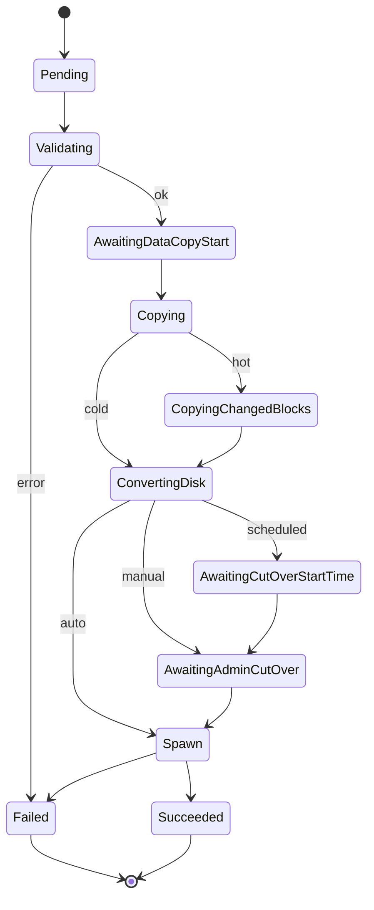
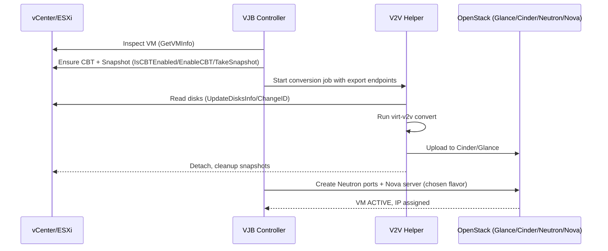

# vJailbreak Detailed Workflow

This document explains how vJailbreak (VJB) orchestrates end‑to‑end VMware → OpenStack migrations, with emphasis on:

- How flavors are selected for target VMs in OpenStack
- How source VMs are attached to the VJB helper VM for conversion, then detached
- How the final OpenStack VM is created from the converted image/volumes

It complements the high‑level features covered in `README.md` and focuses on actionable, operator‑relevant details for deployers.

## Components and Roles

- **VJB Controller (Kubernetes operators/controllers)**
  - Reconciles CRDs like `MigrationPlan`, `MigrationTemplate`, `NetworkMapping`, `StorageMapping`, `VMwareCreds`, and `OpenStackCreds` under `k8s/migration/`.
  - Plans migrations, manages job orchestration, tracks status, runs pre/post checks.

- **Resource Manager (`resmgr`)**
  - Discovers VMware inventory, flavors, networks, storage targets; resolves mappings.
  - Path: `k8s/migration/pkg/sdk/resmgr/resmgr.go`.

- **v2v-helper**
  - A containerized helper that runs `virt-v2v` (2.7.13) and related tooling to convert VMware disks to OpenStack‑compatible images/volumes.
  - See `v2v-helper/` and `v2v-helper/vm/vmops.go` for VM/disk operations.

- **VMware/vSphere**
  - Source ESXi hosts and VMs discovered via vCenter APIs.

- **OpenStack**
  - Destination clouds: Glance (images), Cinder (volumes), Neutron (networks), Nova (compute flavors/instances).

## Appendix A. Implementation Anchors (Code References)

- `v2v-helper/vm/vmops.go`
  - VM introspection and snapshot/CBT handling: `GetVMInfo()`, `IsCBTEnabled()`, `EnableCBT()`, `TakeSnapshot()`, `DeleteSnapshot()`
  - Delta tracking and snapshot metadata: `UpdateDisksInfo()`, `UpdateDiskInfo()`, `CustomQueryChangedDiskAreas()`
  - Power and network control: `VMGuestShutdown()`, `VMPowerOff()`, `VMPowerOn()`, `DisconnectNetworkInterfaces()`
  - VMware inventory via govmomi and PF9 CRDs: `GetVMwareMachine()` and RDM disk enrichment via `copyRDMDisks()`
- `k8s/migration/pkg/constants/constants.go`
  - Migration phases and condition types: `VMMigrationStatesEnum`, `MigrationConditionType*`
  - Operational timings and defaults: `VMActiveWaitIntervalSeconds`, `VMActiveWaitRetryLimit`, `DefaultMigrationMethod`
  - Labels/annotations used across resources (e.g., `VMNameLabel`, controller names)

## Migration Phase and State Model

The controllers surface per‑VM progress using constants in `constants.go`:

- __Phases__: `VMMigrationPhasePending`, `Validating`, `AwaitingDataCopyStart`, `Copying`, `CopyingChangedBlocks`, `ConvertingDisk`, `AwaitingCutOverStartTime`, `AwaitingAdminCutOver`, `Succeeded`, `Failed`, `Unknown` (see `VMMigrationStatesEnum`).
- __Pod Conditions__: `MigrationConditionTypeDataCopy`, `Migrating`, `Validated`, `Failed` reflect job‑level status.

Operators will see these in CR status and controller logs to trace where a migration is in the pipeline.

### Phase-by-Phase Flow

- __Pending__
  - Trigger: `MigrationPlan` created/updated; VM enqueued.
  - Action: Basic validation and inventory discovery.
  - Next: `Validating`.

- __Validating__
  - Action: Check credentials reachability, `NetworkMapping` and `StorageMapping` existence/capacity, quotas, and policy.
  - Pod condition: `Validated` on success, `Failed` on error.
  - Next: `AwaitingDataCopyStart` if conversion is authorized; else `Failed`.

- __AwaitingDataCopyStart__
  - Action: Schedule/helper prep. Ensure snapshot policy, CBT for hot path using `IsCBTEnabled()`/`EnableCBT()`; then `TakeSnapshot()`.
  - Next: `Copying` when the conversion job starts.

- __Copying__
  - Action: Initial bulk copy. `UpdateDisksInfo()` records snapshot backing and ChangeIDs. `virt-v2v` converts system/data disks to artifacts.
  - Pod condition: `DataCopy`.
  - Next: Hot path → `CopyingChangedBlocks`; Cold path → `ConvertingDisk` or straight to spawn depending on pipeline wiring.

- __CopyingChangedBlocks__ (hot only)
  - Action: Delta copy using VMware ChangeIDs via `CustomQueryChangedDiskAreas()`; optional quiesce window.
  - Next: `ConvertingDisk` after final sync, or directly to spawn if conversion integrated.

- __ConvertingDisk__
  - Action: Finalization of converted artifacts, driver/boot remediation, upload to Cinder/Glance.
  - Next: `AwaitingCutOverStartTime` (scheduled) or `AwaitingAdminCutOver` (manual gate) based on plan policy; else directly to spawn in fully automated mode.

- __AwaitingCutOverStartTime__
  - Action: Wait until planned cutover timestamp; controllers use backoff params `VMActiveWaitIntervalSeconds`/`VMActiveWaitRetryLimit` for polling cadence elsewhere.
  - Next: `AwaitingAdminCutOver` or proceed to spawn.

- __AwaitingAdminCutOver__
  - Action: Human approval window. On approval, proceed with source shutdown (`VMGuestShutdown()` or `VMPowerOff()`) and networking safeguards (`DisconnectNetworkInterfaces()` if enabled).
  - Next: Target VM spawn.

- __Succeeded__
  - Action: Target VM ACTIVE, health checks pass; cleanup snapshots via `DeleteSnapshot*`/`DeleteMigrationSnapshots()`/`CleanUpSnapshots()`; optional ESXi host removal.

- __Failed__
  - Action: Error recorded with reason; retry/backoff depending on failure class. Idempotent steps allow re‑runs.

Pod Conditions mapping (typical):
- `DataCopy` → bulk copy in progress.
- `Migrating` → conversion/spawn in progress.
- `Validated` → prechecks passed.
- `Failed` → terminal or retriable error.



## Detailed Mechanics: Attach → Convert → Detach → Spawn

1. __Attach (Source Presentation)__
   - Introspect source VM via govmomi in `GetVMInfo()` to capture CPU, memory, disks, firmware (UEFI detection: `o.Config.Firmware == "efi"`).
   - Ensure CBT if hot migration is configured:
     - Check: `IsCBTEnabled()`; if false, `EnableCBT()` followed by a fresh snapshot.
   - Establish a consistent view of disks:
     - Create snapshot: `TakeSnapshot(name)` for cold/hot initial pass.
     - Populate per‑disk snapshot metadata and VMware ChangeIDs with `UpdateDisksInfo()` / `UpdateDiskInfo()`.
   - Networking safeguards (optional policy): `DisconnectNetworkInterfaces()` prior to cutover to avoid IP conflicts.

2. __Convert (virt‑v2v Execution)__
   - Disks exposed to the helper are read by `virt-v2v` to produce raw/qcow2.
   - System remediation performed by `virt‑v2v` (virtio drivers, bootloader, fstab, cloud‑init enablement) based on detected OS family from `GetVMInfo()`.
   - For hot delta runs, changed regions are derived via `CustomQueryChangedDiskAreas()` using VMware ChangeIDs recorded per disk.

3. __Detach (Source Cleanup)__
   - On successful conversion, helper disconnects from export path and removes temporary constructs.
   - Snapshot lifecycle:
     - Point deletions: `DeleteSnapshot(name)` or `DeleteSnapshotByRef()`; bulk cleanup via `DeleteMigrationSnapshots()` or `CleanUpSnapshots()`.
   - For cold migrations, final consolidation is performed by vCenter on snapshot removal.

4. __Spawn (Target VM Creation)__
   - Storage:
     - Converted artifacts go to Cinder via gophercloud (`blockstorage/v3/volumes`) for boot/data volumes; Glance images used when policy prefers image‑based boot.
     - RDM disks (when present) carry backend hints copied via `copyRDMDisks()` to map to specific Cinder volume types/pools.
   - Networking:
     - Create Neutron ports per NIC mapped from VMware PG/VLAN using `NetworkMapping`; attach to the new server.
   - Compute:
     - Pick flavor (see next section) and create Nova server; wait with `VMActiveWaitIntervalSeconds`/`VMActiveWaitRetryLimit` backoff parameters.



## Target Provisioning (OpenStack)

### Flavor Selection

Inputs available to the controllers:
- From VMware via `GetVMInfo()`:
  - `CPU` (vCPUs), `Memory` (MB), firmware (`UEFI`), NIC details (`NetworkInterfaces`), guest IPs.
  - Disk sizes and boot flag are derived during conversion; RDM metadata via `copyRDMDisks()`.
- From OpenStack catalogs: flavors (vCPUs, RAM, extra_specs), network list, volume types, quotas.

Baseline algorithm (controller side):
- Filter flavors where `vcpus >= CPU` and `ram_mb >= Memory`.
- Prefer boot‑from‑volume to decouple flavor root disk sizing from converted boot volume.
- Apply policy from `MigrationPlan` (NUMA/pinning via flavor `extra_specs`, growth buffers on volumes per `StorageMapping`).
- If no exact match, upscale to the smallest satisfying both CPU and RAM; otherwise surface a validation error for manual override.

Overrides and traceability:
- Per‑VM or per‑template flavor pinning via `MigrationTemplate`.
- Chosen flavor is recorded in plan/VM status for audit.

### Storage (Cinder/Glance)

- The helper uses gophercloud `blockstorage/v3/volumes` to create volumes sized from converted disks (+ optional growth buffer).
- Boot strategy:
  - Boot‑from‑volume (recommended): root volume created from the converted artifact; bypasses flavor root disk limits.
  - Image‑based: upload to Glance, then Nova creates a boot disk from the image.
- Volume types/backends are selected from `StorageMapping`; RDM hints (pool, type) propagate to volume create options.

### Networking (Neutron Ports)

- Each VMware NIC maps to a Neutron network from `NetworkMapping`.
- For each NIC, create a port with security groups/port‑security policies, then attach to the Nova server in create.
- MAC preservation is optional and policy‑driven; default is to re‑DHCP via cloud‑init.

## Observability, Reliability, Security

- __Phases and conditions__: update using `VMMigrationStatesEnum`, `MigrationConditionType*` at each step.
- __Retries/backoff__: transient API failures retried; long waits use `VMActiveWaitIntervalSeconds`, `VMActiveWaitRetryLimit`.
- __Idempotency__: detect/reuse existing images/volumes for safe re‑runs.
- __Secrets__: store credentials in Kubernetes Secrets; least-privilege access.
- __Encrypted data plane__: HTTPS for Glance/Cinder; TLS for NBD where enabled.
- __Snapshot/export hygiene__: snapshots/exports are ephemeral and cleaned up promptly.

## Appendix B. Pseudocode/Examples

```go
// Pseudocode – references real calls in vmops.go and constants.go
info, _ := vmops.GetVMInfo("")
if hot {
    if ok, _ := vmops.IsCBTEnabled(); !ok { _ = vmops.EnableCBT() }
}
_ = vmops.TakeSnapshot("vjailbreak-migrate")
_ = vmops.UpdateDisksInfo(&info)

// Run virt-v2v externally; produce boot/data artifacts

// Create Cinder volumes / Glance image, then pick flavor using info.CPU, info.Memory
// Create Neutron ports per mapped NIC and spawn Nova server

// Cleanup
_ = vmops.CleanUpSnapshots(true)
```

## Cleanup and Decommission

- __Snapshot cleanup__: remove migration snapshots via `DeleteSnapshot*`, `DeleteMigrationSnapshots()` or `CleanUpSnapshots()` after success/finalization.
- __ESXi host decommission (optional)__: when a host is drained and in maintenance mode, the controller can remove it from vCenter per policy for clean source decommissioning.


## End-to-End Flow

1. Discovery and Planning
   - VJB reads VMware inventory (VM hardware, CPU/RAM, disks, NICs, VLAN/PG, power state, VMware Tools) and OpenStack catalogs (flavors, networks, images, storage backends).
   - Operator prepares `NetworkMapping` and `StorageMapping` CRs to map VMware networks/storage to OpenStack equivalents.
   - `MigrationPlan` references credentials and mappings, and defines the migration mode (cold/hot), batches, and scheduling.

2. Pre-Checks
   - Validates credentials reachability and permissions.
   - Confirms mapped networks and storage exist and have capacity.
   - Optionally places ESXi host/VM into a compliant state (snapshots/CBT as configured).

3. Helper VM Preparation (Attach Phase)
   - VJB brings up a temporary VJB Helper VM (or pod with nested VM tooling) that runs `v2v-helper`.
   - Source VM disks are presented to the helper via one of the supported paths:
     - NFC/VDDK data path, or
     - NBD/iSCSI export from ESXi, or
     - VMDK export to a staging datastore, then mounted by the helper.
   - The helper “attaches” to the source by opening the exported disks (read‑only for cold, or with change capture for hot if configured).

4. Conversion (virt-v2v)
   - `virt-v2v` converts the attached VMDKs to QCOW2/raw suitable for OpenStack.
   - Drivers/services are injected as needed (virtio, cloud‑init, udev rules, fstab fixes, bootloader adjustments).
   - Output can be:
     - Imported into Glance as images, or
     - Written directly to Cinder volumes (preferred for large disks).

5. Target Provisioning (Detach + Spawn New VM)
   - After conversion, the helper detaches from the source exports and tears down transient connections.
   - OpenStack resources are created:
     - Glance image or Cinder volumes per disk according to `StorageMapping` policy.
     - Neutron ports created per NIC according to `NetworkMapping`.
     - Nova server is created with the selected flavor (see Flavor Selection below), attached to the ports and boot volumes.
   - Cloud‑init/user‑data can be injected for first‑boot customization.

6. Cutover and Validation
   - For cold migration: the VM was powered off during conversion; the OpenStack VM is booted and validated.
   - For hot migration: a delta pass may run before cutover; after final sync, source is quiesced and target is booted.
   - Health checks: IP acquisition, SSH/WinRM, application/service probes as configured.

7. Cleanup
   - Temporary exports, snapshots, and helper resources are removed.
   - Optionally (when policy allows), ESXi hosts drained of all VMs are removed from vCenter inventory (see controller utility for safe removal).

## Flavor Selection Algorithm

VJB aims to preserve (or minimally upscale) source VM sizing while adhering to destination constraints.

Inputs collected from VMware:
- vCPU count, CPU reservation/shares
- Memory size (MiB)
- Disk layout (system vs data, sizes, thin/thick)
- Special features (NUMA, EFI/BIOS, CPU flags) when detectable

OpenStack catalogs:
- List of flavors: vCPUs, RAM, ephemeral/root disk, extra_specs (NUMA, CPU policy)
- Project quotas and host aggregates/availability zones

Selection steps:
1. Baseline Match
   - Find flavors with `vcpus >= source.vcpus` and `ram_mb >= ceil(source.ram_mb)`. If `root_disk_gb` is enforced, ensure it fits the boot volume/image (or prefer boot‑from‑volume to decouple from flavor disk).

2. Policy Adjustments
   - Apply placement policies from `MigrationPlan` (e.g., min upscale, max cap, NUMA affinity, CPU pinning if required by workload).
   - If source has high CPU reservation or latency‑sensitive flags, prefer flavors with `extra_specs` for dedicated CPU or pinned policy.

3. Storage Strategy Interaction
   - If boot‑from‑volume is used (recommended), ignore flavor root disk and size the Cinder volume(s) from converted disk sizes plus growth buffer (configured in `StorageMapping`).

4. Network/Quota Constraints
   - Ensure selected AZ/aggregate has capacity and mapped networks are reachable.

5. Fallbacks
   - If no exact match, pick the smallest flavor that satisfies both CPU and RAM (upscale). If policies disallow upscale, surface a validation error in status and mark plan for manual override.

Overrides:
- Operators can pin a specific flavor per VM or per template via `MigrationTemplate`.
- Per‑VM exceptions (e.g., memory‑heavy DBs) can be annotated in the plan.

Outcome:
- The chosen flavor name/ID is recorded in `MigrationPlan` status for traceability and auditing.

## Attach → Convert → Detach → Spawn

This section details the example you asked for.

1. Attach
   - VJB coordinates with vCenter to export the VM’s disks (snapshot taken for cold path; optionally CBT/delta for hot path).
   - The VJB Helper VM (`v2v-helper`) connects to the export endpoint (VDDK/NBD/iSCSI) and exposes block devices to `virt-v2v`.
   - No long‑term state is written to the source; attachments are transient and cleaned up.

2. Convert
   - `virt-v2v` reads the exported block devices and produces OpenStack‑compatible images/volumes.
   - System adjustments are applied: virtio drivers, network interface renaming, initramfs, bootloader fixes, cloud‑init enablement, fstab and udev rules normalization.

3. Detach
   - After successful conversion, the helper disconnects from the export path, snapshots are consolidated (cold), and any temporary staging is removed.

4. Spawn New VM
   - Glance images and/or Cinder volumes are used to create the target Nova server with the selected flavor.
   - Neutron ports are created and attached according to `NetworkMapping` (VLAN → network, PG → subnet/port‑security settings).
   - The VM boots; health checks verify reachability and application readiness.

## Hot vs Cold Migration

- Cold (recommended for simplicity)
  - Power off source during conversion.
  - Single pass; minimal risk of data inconsistency.

- Hot (reduced downtime)
  - Initial sync while source is running, then delta pass with quiesce at cutover.
  - Requires CBT/delta export support and appropriate VMware privileges.

## Networking Details

- NICs are translated from VMware PG/VLAN to Neutron networks defined in `NetworkMapping`.
- MAC preservation is optional; IP re‑acquisition commonly handled by DHCP/cloud‑init.
- Security groups, allowed‑address‑pairs, and port‑security can be set per port.

## Storage Details

- System disk becomes boot volume (Cinder) or a Glance image used to create a boot volume.
- Data disks map 1:1 to Cinder volumes unless a consolidation policy is configured.
- Volume types (backends) are chosen via `StorageMapping` (e.g., `gold-ssd`, `silver-hdd`).

## Failure Handling and Observability

- Each phase updates CR status with progress, per‑VM logs, and error details.
- Retries with exponential backoff for transient API/transport failures.
- Idempotent steps for safe re‑runs (e.g., existing images/volumes detection).

## Post-Migration Cleanup

- Temporary helper artifacts removed.
- Optionally, when an ESXi host has no remaining VMs and is in maintenance mode, VJB invokes safe vCenter removal of the host (configurable policy).

## Security Considerations

- Credentials are stored in Kubernetes secrets and referenced by CRs; scope them minimally.
- Data path uses encrypted transports where supported (NBD over TLS, HTTPS for Glance, encrypted Cinder backends if available).
- Snapshots/deltas are ephemeral; ensure staging locations are access‑controlled.

## Operator Tips

- Prefer boot‑from‑volume to avoid flavor root disk mismatch.
- Validate mappings and quotas before large batches.
- Start with cold migrations to reduce complexity; move to hot after validating the end‑to‑end flow.
- Use per‑VM overrides for special workloads (NUMA/pinning).
